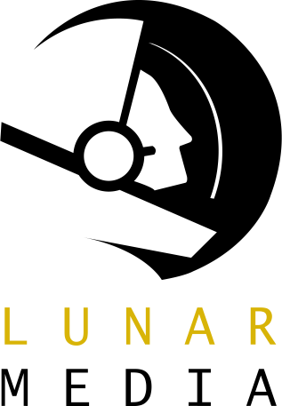

# Bootcamp - Lunar Media

### Authors
* Scott Olthoff - Motion
* Brisk Yunus - Design
* Michael Prior - Front End Development
* Philip Wood - Back End Development

### Prerequisites
All that is needed to run this project is a web browser. Google Chrome is recommended.

### How to Run
Clone the project, navigate to the directory - <code>cd directoryname</code> - and open the index.html file in your web browser with a server.

### Purpose
This project is to be completed for the Bootcamp project assigned in MMED-3038 Electronic Image Production and MMED-3039 Multimedia Authoring 3.

The purpose of this project is to demonstrate the skills that we learned in the first year of the Interactive Media Design program, develop our ability to work as part of a team, and to introduce us to stricter time frames that are commonplace in the work world.

### Project Outline
The objecive of the project is to create a responsive site for a professional advertising agency with an original logo and tagline. Original imagery and a promotional video are also required.

__Due Date:__ September 20, 2019 at 11:59 PM

### Languages Used
* HTML (HTML5)
* CSS (CSS3) 
* JavaScript

### Programs and Resources Used
* Adobe XD
* Adobe Photoshop
* Adobe Premiere
* Adobe After Effects
* Visual Studio Code
* Audacity
* Github / Git Bash
* Google Chrome
* SASS